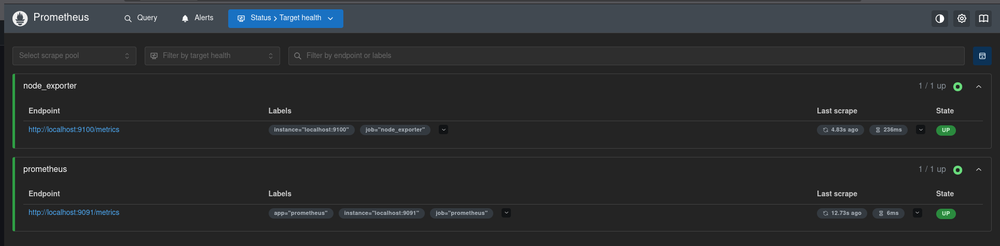
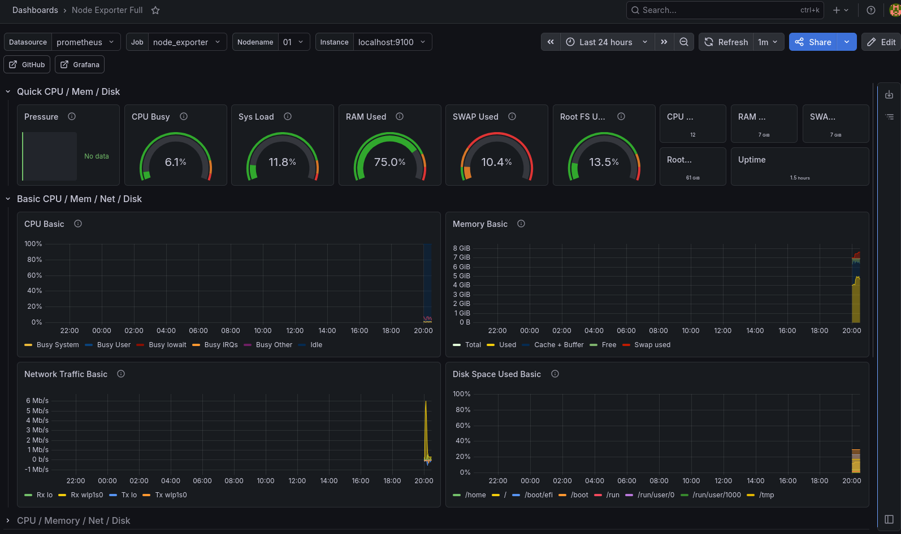
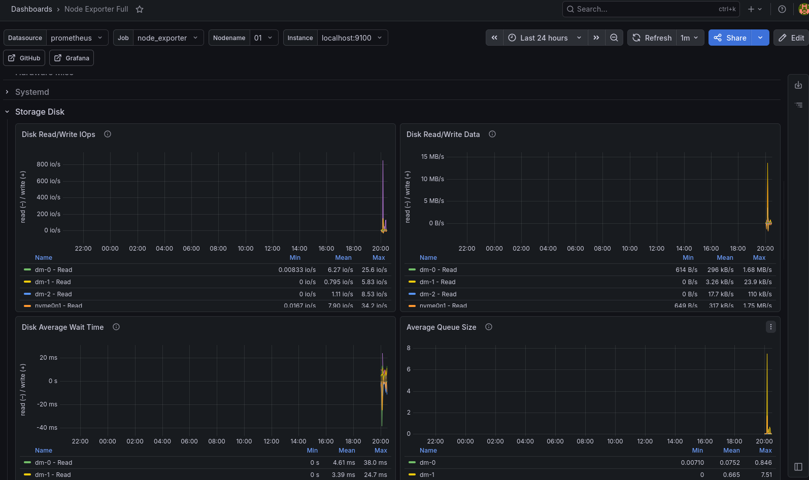

# Prometheus + Grafana Monitoring on AlmaLinux

## Overview

This project demonstrates the deployment of a monitoring stack using Prometheus, Node Exporter, and Grafana on AlmaLinux.

## Architecture

Node Exporter → Prometheus → Grafana

## Components

* AlmaLinux
* Prometheus
* Node Exporter
* Grafana

## Features

* CPU Monitoring
* Memory Monitoring
* Disk Usage Monitoring
* Filesystem Monitoring
* Network Monitoring
* System Load Monitoring

## Screenshots

### Prometheus Targets

### Grafana Dashboard

### Disk Monitoring

## Validation

* Prometheus Target Status: UP
* Node Exporter Status: UP
* Grafana Dashboard: Working

## Troubleshooting

### Port Conflict

Cockpit was already using port 9090.

Prometheus was configured to use port 9091.

## Skills Demonstrated

* Linux Administration
* Monitoring and Observability
* Prometheus
* Grafana
* Troubleshooting
* Systemd Service Management
